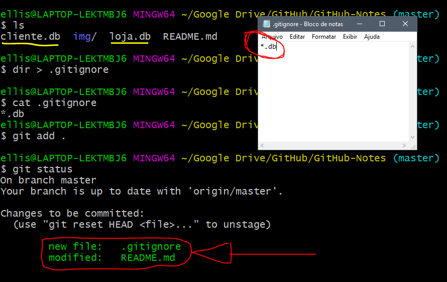

# Socorro! Git e GitHub.


## Configurando o Git logo após instalação

Deve-se configurar email e nome:

```shell
git config --global user.email "ellison.guimaraes@gmail.com"
git config --global user.name "Ellison William"
```

Ou o editor:

```shell
git config --global core.editor emacs
```


Para saber quais são os dados aplicados posteriormente:

```shell
git config user.name
```

Irá retornar o nome inserido, assim como `git config user.email` o email. 


## Inicializando um repositório

Primeiramente, devemos criar uma pasta, acessa-lá e escrever o seguinte comando:

```shell
git init
```

Se você der um `ls -la`, verá que foi criado um diretório oculto chamado ***.git***.


## Comandos


### Git Status

Através desse comando `git status`, é possível ver quais sãos os estados dos arquivos no repositório.  Estados possíveis:


- `untracked`: Não foi adicionado (`git add ...`)
- `unmodified`: Foi adicionado (não comitado)
- `modified`: Foi modificado
- `staged`: Foi comitado.


Na imagem a seguir podemos verificar dois dos estados:


### Git Add

O comando `git add` serve para adicionar os arquivos ao repositório. Não basta somente colocar os arquivos na pasta, deve-se adicionar cada item para o repositório.

Pode ser utilizado o `git add .` que adiciona ***TODOS*** os arquivos, ou o `git add nomearquivo.txt` para especificar o arquivo.


> Foi utilizado na sessão anterior o `git add` específico.


### Git Commit

Até agora adicionamos e criamos os repositório, para salvar uma versão usasse o `commit`. Para adicionar uma nova versão é usado o seguinte comando:

```shell
git commit -m "Mensagem de especificação"
```

`-m` indica que vai ser inserido uma mensagem e em seguida e mensagem em aspas duplas.

A partir daí, tem-se uma versão!


Pode ser visto um código que é **ÚNICO**, a quantidade de arquivos modificados e em qual *branch* foi adicionada.


### Git Log

Através do comando `log` podemos obter informações de todos os `commits`. Informações como hash, data, autor, branch, descrição e etc.

- `git log`: Descreve todos os `commits` em ordem mais recente.
- `git log --author="ellison"`: Busca os `commits` específicos desse autor.
- `git log --graph`: Mostra de forma gráfica o caminho dos `commits` e se houve desvio/branch.
- `git show 589984561dsadsa694a`: Informando a hash verifica-se mais informações do `commit`.


Exemplos:


e o `log show hash`:


### Git Diff

Parecido com o `log show hash`, porém, o `log show` é utilizado para arquivos já comitados. Já o `git diff` é usado para verificar quais arquivos que foram modificados antes de dar um `commit`.


O `git diff --name-only` mostra somente o nome dos arquivos modificados.


### Git Checkout

Caso você tenha editado um arquivo que ainda não tenha feito `git add` e queira recuperar o arquivo anterior, basta da um `git checkout nomearquivo.md`.

E se já tiver dado o `add` ou o `commit`? Use o:


### Git Reset

O comando `git reset HEAD README.md`, tira do processo de `add` e retorna para o `modified`, onde pode ser modificado ou aplicado o `git checkout nomearquivo.md` para tirar toda a mudança feita.


**E se já estiver comitado?**

No reset, existem 3 tipos de variações:

- `--soft`: Vai matar o `commit` mas as modificações estará em `stated` para ser  comitado novamente.
- `--mixed`: O mesmo que o de cima, porém, vai retornar para **modified**.
- `--hard`: Mata e ignora as modificações.


Um pequeno exemplo com `git reset --hard hash`:


Podemos observar através do `git log` que existe um `commit` de nome "**return**" e o intuito é voltar para a "**finals**". Para isso, aplicamos o `git reset --hard 55cd878668a723dd573a49660396ddcec949157b ` e voltamos para o `commit` desejado:


# Repositórios Remotos

Agora que já temos nosso repositório criado precisamos jogar o repositório no GitHub. Para isso, iremos criar uma novo repositório no GitHub. Após ter criado, iremos pegar o key HTTPS ou SSH e executar o comando:

```shell
git remote add origin https://github.com/ellisonguimaraes/GitHub-Notes.git
```

O comando acima liga a pasta ao repositório no GitHub, mas ainda é necessário fazer um push para que os arquivos subam pro GitHub:

```shell
git push -u origin master
```

Logo após, o código estará disponível no GitHub.

> O `-u` na instrução *push*, é somente para indicar que é para que não precise escrever mais o restante depois do `-u`. Das próximas vezes somente é necessário da `git push`.

> Nos comandos, a palavra **origin** aparece frequentemente. `origin` é uma referência aos dados contidos no GitHub. 
>
> No `git remote add origin https://gith.....` atribui o repositório á palavra chave `origin`. E no push, siginifica que é para passar do branch master local para o origin(servidor).

> O comando `git remote` lista todas as palavras chaves com referência do GitHub.


## Push

Para fazer um *Push*, não é necessário colocar o `-u` como foi mencionado acima. A instrução será: 

```shell
git push origin master
```

Ou seja, irá mandar do branch *master* para o *origin*.


## Clone

Para clonar um repositório, acesse a key HTTPS ou SSH e execute:

```shell
git clone git@github.com:ellisonguimaraes/GitHub-Notes.git
```


# Branch


## Criando

Para criar um branch, utiliza-se o comando:

```shell
git checkout -b NomeBranch
```

Ao executar esse comando a *branch* é criada e muda da *brench* atual para a *branch* criada.

> Usando o comando `git branch` ele lista os *branch's* daquele repositório.


Podemos observar que foi trocada a *branch* na hora da criação, e que listando, podemos ver todas as *branch's* disponíveis.


## Acessando as branch's

Para mudar de *branch*, usa-se o comando `git checkout NomeBranch`:


Foi observado que foi mudado a *branch*.


## Excluindo

Para excluir uma *branch*, é utilizado o código `git branch -D NomeBranch`:


## Merge & Rebase

Assim que temos um *branch* e queremos aplicar as alterações ao *branch* principal (master). Existem **duas** formas de fazer isso, via **Merge** e via **Rebase**.


### Merge

Quando se tem uma *branch* e a escolha de juntar a master é através do Merge: O merge cria um novo *commit* com a junção do *branch* com o *master*.


Na *branch master* acione o comando:

```shell
git merge NomeBranch
```


### Rebase

O *rebase* aplica todas as mudanças a frente da pilha, ou seja: 


O *branch* criado é adicionado ao final da fila e o *master* aponta para o final da pilha novamente:


Na *branch master* acione o comando:

```shell
git rebase NomeBranch
```


## .gitignore

O `.gitignore` é um arquivo que fica dentro da pasta raiz. Dentro dela adicionamos arquivos que não queremos que vá para o GitHub no *commit*.

Por exemplo:



No exemplo acima, temos na pasta dois arquivos `.db` e criamos um `.gitignore` com o `*.db`, ou seja, todos os arquivos com extensões `.db` não vão ser inclusos no *commit*. Logo abaixo poderá ver que ao dar um **add** os arquivos são ignorados.

Se quiser somente barrar um arquivo específico, é só especificar o nome dele. Por exemplo, `cliente.db`.